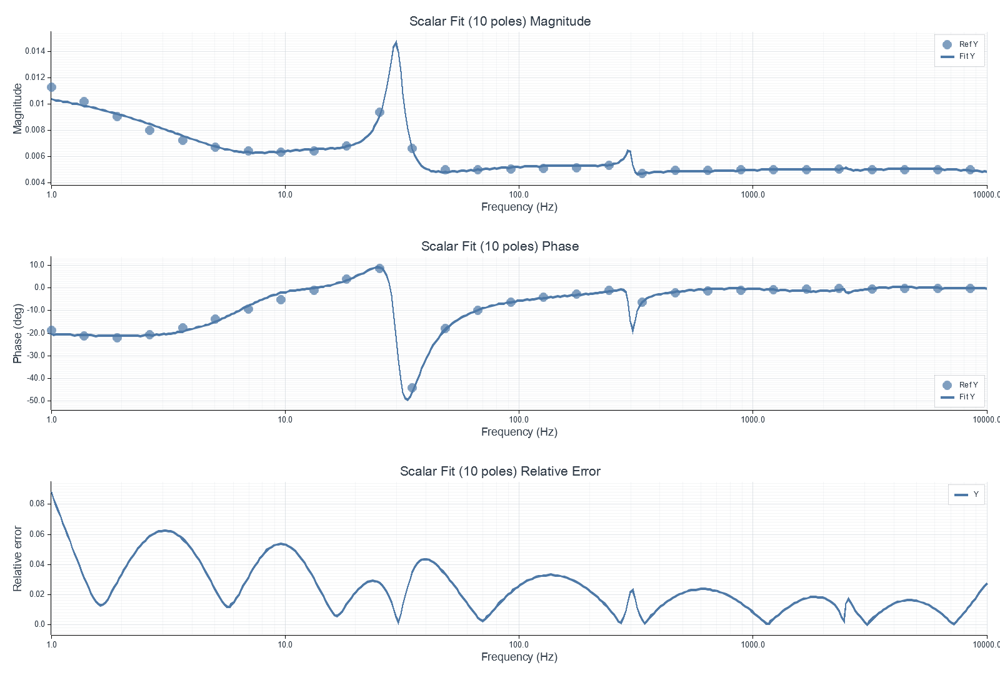
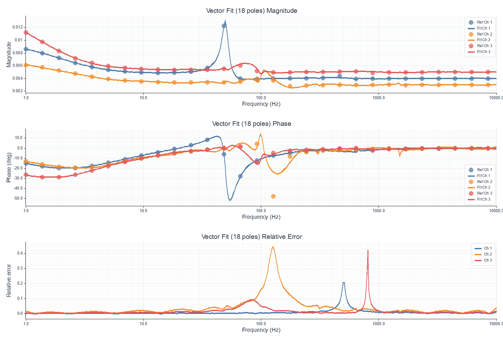
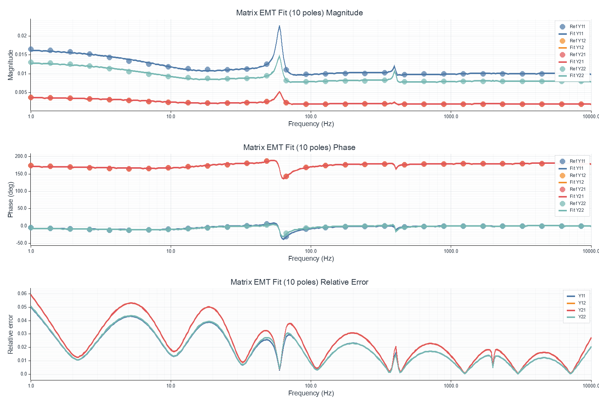

# vecfit

[](https://crates.io/crates/vecfit)
[](https://docs.rs/vecfit)
[](https://github.com/lukelowry/vecfit/actions/workflows/ci.yml)
[](LICENSE-MIT)
[](https://blog.rust-lang.org/2025/02/20/Rust-1.85.0.html)

Pure-Rust implementation of relaxed vector fitting
for rational approximation of frequency-domain data.
Fits scalar, vector, and matrix-valued responses.

```toml
[dependencies]
vecfit = "0.1"
```

## Quick start

```rust
use vecfit::{Csv, Options};

let csv = "\
freq_Hz,re_f1,im_f1
1.0,0.95,-0.31
3.0,0.55,-0.62
10.0,0.22,-0.78
30.0,0.08,-0.45
100.0,0.02,-0.15
";

let model = Csv::from_csv(csv)?.fit(Options::new().poles(3))?;
```

Column formats are auto-detected from headers: `re_*`/`im_*` for rectangular,
`|*|`/`ang_*` for magnitude/phase.

## Input formats

**CSV** from a file:

```rust,no_run
use vecfit::{Csv, Options};

let model = Csv::from_path("data.csv")?.fit(Options::new().poles(4))?;
```

Also supports TSV (`from_tsv`), SSV (`from_ssv`), and custom delimiters (`from_delimited`).
For matrix-valued data, chain `.matrix(rows, cols)?` before `.fit(...)`.

**Touchstone** (.s1p, .s2p, ...):

```rust,no_run
use vecfit::{Touchstone, Options};

let model = Touchstone::from_path("network.s2p")?.fit(Options::new().poles(6))?;
```

Supports S/Y/Z/G/H/T parameters, RI/MA/DB formats, and all standard frequency units.

## Closure fitting

For analytic transfer functions, pass a closure directly:

```rust
use num_complex::Complex64;
use vecfit::{Model, Options, complex};

let s: Vec<Complex64> = (0..80)
    .map(|k| Complex64::new(0.0, 1.0 + k as f64))
    .collect();

let model = Model::fit(
    complex(&s),
    |s| 0.05 + 1.2 / (s + 3.0) + 0.4 / (s + 15.0),
    Options::new().poles(4),
)?;
```

Closures can return scalars, arrays, or nested arrays — the shape is inferred automatically.
See the [API docs](https://docs.rs/vecfit) for `c(re, im)`, axis wrappers (`hz`, `rad`, `real`),
and matrix fitting.

## Axis wrappers

| Wrapper | Closure receives | Internal mapping | Typical use |
|---|---|---|---|
| `hz(&freq)` | `f64` (Hz) | `j 2 pi f` | measured frequency data |
| `rad(&omega)` | `f64` (rad/s) | `j omega` | angular frequency |
| `real(&x)` | `f64` | `x` (real line) | kernel fitting, Laplace domain |
| `complex(&s)` | `Complex64` | passthrough | full control |

## Examples

```bash
cargo run --example fit_scalar          # scalar closure fit
cargo run --example fit_vector          # multi-channel vector fit
cargo run --example fit_csv             # CSV parse-and-fit
cargo run --example json_roundtrip      # JSON serialize/deserialize
cargo run --example export_matrix_emt   # real-section + state-space export
cargo run --example plot_scalar_report  # plotted report (PNG + Markdown)
```

### Scalar fit (10 poles, RMSE 2.2e-4)



### Vector fit (18 poles, 3 channels, RMSE 2.3e-4)



### Matrix EMT fit (10 poles, 2x2, RMSE 1.9e-4)



## Author

[Luke Lowery](https://lukelowry.github.io/) · [Google Scholar](https://scholar.google.com/citations?user=CTynuRMAAAAJ&hl=en)

## Related projects

- [gspx](https://github.com/lukelowry/gsp-rust) — graph signal processing in Rust, uses `vecfit` for its fitting backend
- [sgwt](https://github.com/lukelowry/sgwt) — spectral graph wavelet transform in Python ([docs](https://sgwt.readthedocs.io/))

## License

Licensed under either of [Apache License 2.0](LICENSE-APACHE) or [MIT](LICENSE-MIT), at your option.
